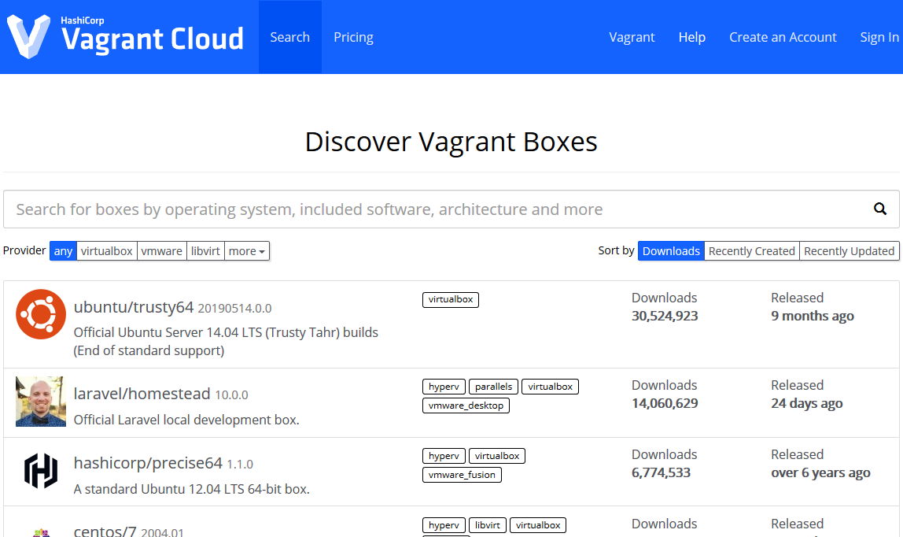
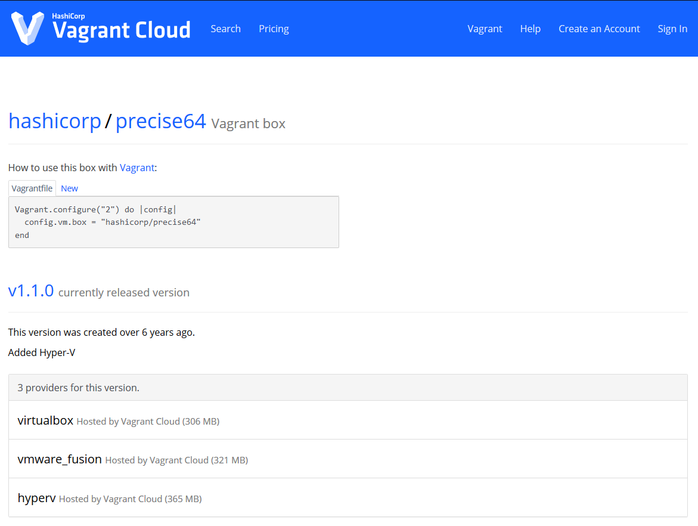

## >>INTRO

Have you ever decided to nuke your penetration testing machine because it got too polluted? Maybe you needed multiple configurations for different clients or use cases (such as web app hacking, hardware hacking) that needed specialized tools? Or maybe you're the type of person who needs to quickly initialize a small test network that has a few clients, such as spinning up an instance of [a small Caldera network](https://github.com/mitre/caldera)? If any of these situations sound familiar, it might be time to migrate your workflow over to include [Vagrant](https://www.vagrantup.com/)!

## >>WHAT IS VAGRANT?

Vagrant is a piece of free-and-open-source software (FOSS) that I've been using for around 1.5 years now - and it's absolutely changed how I do things both at work and at home. I'll let Hashicorp explain it themselves:

> Vagrant is a tool for building and managing virtual machine environments in a single workflow. With an easy-to-use workflow and focus on automation, Vagrant lowers development environment setup time, increases production parity, and makes the "works on my machine" excuse a relic of the past.

So ultimately, what does this mean? If you've kept up with the DevOps world of the past few years this should all sound pretty familiar - Vagrant allows us to deploy and manage virtual machines in an automated fashion using Infrastructure-as-Code. Ultimately you end up writing a piece of code - the almighty `Vagrantfile` - and that is what Vagrant reads in to figure out its marching orders.

## >>PENTESTING IN THE STONE AGES

Let's think back to how we would make virtual machines previously - let's assume it's a standard job for a client who has a web application, maybe you're doing some [bug bounty work like Stök](https://www.youtube.com/channel/UCQN2DsjnYH60SFBIA6IkNwg) and wanted a clean environment. You'd first go grab the ISO for the OS distro of your choice - for most people that would be either Kali or Parrot - and then you'd go into your hypervisor and create a new machine and *manually* walk through the install process. You'd finally be dropped in to a terminal or DE and start your customizations - performing things like `sudo apt-get update && sudo apt-get full-upgrade -y` and installing tools like [Comby](https://comby.dev/) and [pwndbg](https://github.com/pwndbg/pwndbg). Once you were finally finished you would snapshot the image or *maybe* you'd do something like linked clones in VMWare to make a pseudo-golden image that you could pass around on engagements. Overall it's not a terrible process - but is there a better way?

## >>THE FUTURE IS NOW

Let's change up our process - Vagrant will shake up a little bit of the monotonous tasks and help us modularize our lives, just a little bit. Here's a typical minimal structure I use for my projects.

```
environments/
    |__ extras/
    |__ packer/
        |__ boxes/
        |__ os_folders/
    |__ scripts/
        |__ os_folder_1/
            |__ specific_build_1/
            |__ comby.sh
        |__ os_folder_2/
            |__ different_script.sh
    |__ vagrant
        |__os_folders/
            |__ Vagrantfile
```

So breaking this down, we have:

* `environments`: The top level folder (organization FTW!)
* `extras`: Any files that are miscellaneous (I use this for things like backgrounds, config files, etc)
* `packer`: This is another tool from Hashicorp, we'll cover what it does soon!
* `scripts`: This is where I house any bash scripts that I've written. Generic, shared ones are hosted in `os_folder` and specific builds are hosted in their own sub-dirs.
* `vagrant`: This holds our different OS builds and their `Vagrantfile`s.

There can be other stuff included as you get more into this - for example, I'm *eventually* going to migrate off of relying on cheap bash scripting tricks and instead migrate to Saltstack so I think I'd add in a `salt/` directory to house the scripts there. Speaking of Saltstack, Vagrant has quite a bit of support for [DevOps configuration management providers](https://www.vagrantup.com/docs) - click the link or look up the Vagrant docs and check out "Provisioners" on the sidebar for more info!

Cool, so we have an idea of how a project is structured and are excited about the future of our personal workflow - what do we need to get started? Depending on your configuration, so of these may vary but here's what I'll use for the rest of the tutorial:

* VMWare Workstation Pro
* Vagrant
* [vagrant-vmware-utility](https://www.vagrantup.com/vmware#buy-now)
* Packer

It's worth noting that the VMWare version of Vagrant costs some money - don't let that deter you. They offer the Virtualbox plugin for free, and it works just the same. All code that I show should be relatively easy to port over to a Virtualbox-based setup. Now we'll start with making a simple box!

## >>MAKING A GOLDEN IMAGE LIKE A CHEATER

Now that we've got our project set up, we'll start making our gold image - as Vagrant would call it, a "base box". There are ~~two~~ three ways to do a base box - Vagrant cloud, creating our own, and using Packer to build one from the ground up. We'll skip that last one and cover the first two because they're easier to get a grasp on.

### $IT'S NOT A COMPUTER, IT'S THE CLOUD!

So Vagrant cloud is essentially a repository for already-created boxes, both in public and private (for money). I'll once again defer to Hashicorp for the better definition:

> Vagrant Cloud serves a public, searchable index of Vagrant boxes. It's easy to find boxes you can use with Vagrant that contain the technologies you need for a Vagrant environment.  
You don't need a Vagrant Cloud account to use public boxes.



Basically, this service lets us browse boxes that other people have made and just use them - pretty fantastic! I know the more paranoid among you don't trust this - and for good reason, as you don't control the box that's being loaded - so that's why we have the second category. For those who don't mind, instructions are straightforward from this point; click on the box that you're interested in and be greeted with the following screen:



That screen shows you what Vagrantfile you should use with the box. You can either copy and paste it, or you can navigate to the directory you want to place your new VM in and run `vagrant init ubuntu/trusty64`. Once you do that, you'll have a shiny new Vagrantfile in the current directory and can just type `vagrant up` - the box will automagically be created! Simple, short, and sweet - our favorite.

### $A BOX MADE FOR OUR OWN SPECIAL IMAGE


## >>LOOK MA, NO HANDS!
(section talking about the automation portion with vagrant)


## >>NOW FOR MY NEXT TRICK...
(section detailing multi-machine configurations)


## >>REFERENCES


