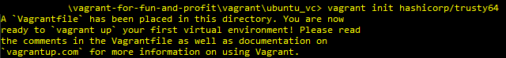
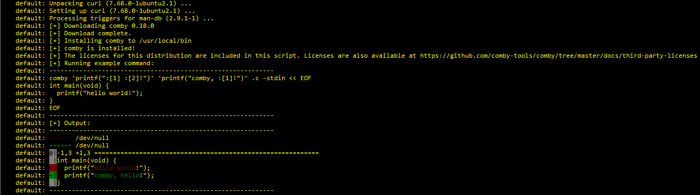

## >>INTRO

Have you ever decided to nuke your penetration testing machine because it got too polluted? Maybe you needed multiple configurations for different clients or use cases (such as web app hacking, hardware hacking) that needed specialized tools? Or maybe you're the type of person who needs to quickly initialize a small test network that has a few clients, such as spinning up an instance of [a small Caldera network](https://github.com/mitre/caldera)? If any of these situations sound frustrating and tedious, it might be time to migrate your workflow over to include [Vagrant](https://www.vagrantup.com/)!

**NOTE**: As you go throughout this tutorial, keep in mind that I'm self-taught - I'm by no means a DevOps expert nor do I know everything there is to know about Vagrant. I'm just a huge nerd that enjoys the Hashicorp ecosystem for automation!

## >>WHAT IS VAGRANT?

Vagrant is a piece of free-and-open-source software (FOSS) that I've been using for around 1.5 years now - and it's absolutely changed how I do things both at work and at home. I'll let Hashicorp explain it themselves:

> Vagrant is a tool for building and managing virtual machine environments in a single workflow. With an easy-to-use workflow and focus on automation, Vagrant lowers development environment setup time, increases production parity, and makes the "works on my machine" excuse a relic of the past.

So ultimately, what does this mean? If you've kept up with the DevOps world of the past few years this should all sound pretty familiar - Vagrant allows us to deploy and manage virtual machines in an automated fashion using Infrastructure-as-Code. Ultimately you end up writing a piece of code - the almighty `Vagrantfile` - and that is what Vagrant reads in to figure out its marching orders.

## >>PENTESTING IN THE STONE AGES

Let's think back to how we would make virtual machines previously - let's assume it's a standard job for a client who has a web application, maybe you're doing some [bug bounty work like Stök](https://www.youtube.com/channel/UCQN2DsjnYH60SFBIA6IkNwg) and wanted a clean environment. You'd first go grab the ISO for the OS distro of your choice - for most people that would be either Kali or Parrot - and then you'd go into your hypervisor and create a new machine and *manually* walk through the install process. You'd finally be dropped in to a terminal or DE and start your customizations - performing things like `sudo apt-get update && sudo apt-get full-upgrade -y` and installing tools like [Comby](https://comby.dev/) and [pwndbg](https://github.com/pwndbg/pwndbg). Once you were finally finished you would snapshot the image or *maybe* you'd do something like linked clones in VMWare to make a pseudo-golden image that you could pass around on engagements. Overall it's not a terrible process - but is there a better way?

## >>THE FUTURE IS NOW

Let's change up our process - Vagrant will shake up a little bit of the monotonous tasks and help us modularize our lives, just a little bit. Here's a typical minimal structure I use for my projects.

```
environments/
    |__ extras/
    |__ packer/
        |__ boxes/
        |__ os_folders/
    |__ scripts/
        |__ os_folder_1/
            |__ specific_build_1/
            |__ comby.sh
        |__ os_folder_2/
            |__ different_script.sh
    |__ vagrant
        |__os_folders/
            |__ Vagrantfile
```

So breaking this down, we have:

* `environments`: The top level folder (organization FTW!)
* `extras`: Any files that are miscellaneous (I use this for things like backgrounds, config files, etc)
* `packer`: This is another tool from Hashicorp, we'll cover what it does soon!
* `scripts`: This is where I house any bash scripts that I've written. Generic, shared ones are hosted in `os_folder` and specific builds are hosted in their own sub-dirs.
* `vagrant`: This holds our different OS builds and their `Vagrantfile`s.

There can be other stuff included as you get more into this - for example, I'm *eventually* going to migrate off of relying on cheap bash scripting tricks and instead migrate to Saltstack so I think I'd add in a `salt/` directory to house the scripts there. Speaking of Saltstack, Vagrant has quite a bit of support for [DevOps configuration management providers](https://www.vagrantup.com/docs) - click the link or look up the Vagrant docs and check out "Provisioners" on the sidebar for more info!

Cool, so we have an idea of how a project is structured and are excited about the future of our personal workflow - what do we need to get started? Depending on your configuration, so of these may vary but here's what I'll use for the rest of the tutorial:

* VMWare Workstation Pro
* [Vagrant](https://vagrantup.com)
* [vagrant-vmware-utility](https://www.vagrantup.com/vmware#buy-now)
* [Packer](https://www.packer.io/)

It's worth noting that the VMWare version of Vagrant costs some money - don't let that deter you. They offer the Virtualbox plugin for free, and it works just the same. All code that I show should be relatively easy to port over to a Virtualbox-based setup. Now we'll start with making a simple box!

## >>WHAT WE'LL BE BAKING TODAY

Let's start with describing our ending directory structure state for this project:

```
environments/
    |__ extras/
    |__ packer/
        |__ boxes/
        |__ ubuntu/
            |__ vagrant-ubuntu-custom-vmx.json
            |__ Vagrantfile.tpl
            |__ vars-vagrant-ubuntu-custom-vmx.json
    |__ scripts/
        |__ ubuntu/
            |__ comby.sh
            |__ open-vm-tools.sh
            |__ python.sh
            |__ sudoers.sh
            |__ update.sh
            |__ vagrant.sh
    |__ vagrant
        |__ ubuntu_vc/
            |__ Vagrantfile
        |__ ubuntu_custom/
            |__ Vagrantfile
```

Essentially, this will end up being a simple Ubuntu box that has downloaded Comby and is ready to use it. The final setup will be hosted [on my GitHub](https://github.com/sp1icer/vagrant-for-fun-and-profit) for you to browse through, but I recommend following along and manually performing this. Also - as you do this, you should include a line in your `.gitignore` to not track any files in `boxes/*`. They're just generically not worth putting into GitHub (and also are a decent size)

## >>MAKING A GOLDEN IMAGE (LIKE A CHEATER)

Now that we've got our project set up, we'll start making our gold image - as Vagrant would call it, a "base box". There are ~~two~~ three ways to do a base box - Vagrant cloud, creating our own, and using Packer to build one from the ground up via kickstart/preseed files. We'll skip that last one and cover the first two because they're *far* easier to get a grasp on.

### $IT'S NOT A COMPUTER, IT'S THE CLOUD!

**NOTE**: This method is going to produce different results from doing it DIY - you won't have a desktop environment, for example. This method will pull down a build of Ubuntu server. Just keep that in mind as you go forth using Vagrant Cloud.

So Vagrant cloud is essentially a repository for already-created boxes, both in public and private (for money). I'll once again defer to Hashicorp for the better definition:

> Vagrant Cloud serves a public, searchable index of Vagrant boxes. It's easy to find boxes you can use with Vagrant that contain the technologies you need for a Vagrant environment.  
You don't need a Vagrant Cloud account to use public boxes.


Basically, this service lets us browse boxes that other people have made and just use them - pretty fantastic! I know the more paranoid among you don't trust this - and for good reason, as you don't control the box that's being loaded - so that's why we have the do-it-ourself method. For those who don't mind using public boxes, instructions are straightforward from this point; click on the box that you're interested in and be greeted with the following screen:


That screen shows you what Vagrantfile you should use with the box. Navigate to `/vagrant/ubuntu_vc`. You can either copy and paste it into a Vagrantfile, or you can run `vagrant init hashicorp/trusty64`. Once you do that, you'll have a shiny new Vagrantfile in the current directory and can just type `vagrant up` - the box will automagically be created! Simple, short, and sweet - our favorite. We'll get to customizing the Vagrantfile in a few sections, so kick back for now.



It's also worth noting that every time you add in a new box from Vagrant Cloud, your machine saves it locally on disk under `$HOME/.vagrant.d/` - so be careful if you have space limitations. Some VMs may not need *much* space, but they definitely add up!

### $A BOX MADE FOR OUR OWN SPECIAL IMAGE

If you don't trust the Vagrant cloud images, there is an alternative - creating a box by hand. The bad news it's a tedious process, just like the stone ages - the good news is we only have to do the whole thing once. Let's start with a Ubuntu image, since that's what I showed in the Vagrant cloud section.

1. Download your target Ubuntu ISO - in my case, Ubuntu Desktop 20.04.
2. Create a new VM in your hypervisor of choice using said ISO - make sure to create a user of `vagrant` and password of `vagrant`. Also set the HDD to 40GB just in case - we shouldn't even get close to that, but it's a maximum so let's be a bit generous.
3. Once installation is done, run `sudo apt-get update && sudo apt-get -y full-upgrade`.
4. Reboot the VM.
5. `sudo apt-get install -y linux-headers-$(uname -r) build-essential dkms`
6. Reboot again.
7. `sudo apt-get install -y open-vm-tools-desktop fuse ssh`.
8. `sudo service ssh restart`
9.  Finally, shut the box down.

### $ARTISINAL JSON FILES

After this whole process, we have a pretty decent setup for a gold image - I recommend not adding more customization than necessary at this point. Here's where we finally use Packer - it will bundle up the box for us and make it ready to use in Vagrant. To do this, navigate to the `packer/` directory and either make/navigate into the `ubuntu_custom` folder there. We'll need a file to tell Packer what to do and how to handle the data - for this, we use the [Packer vmware-vmx provider.](https://www.packer.io/docs/builders/vmware-vmx.html) This file is going to be a JSON file that holds all changes to make to the base image before packaging it for Vagrant consumption. Name this one something like `vagrant-ubuntu-custom-vmx.json`.

```JSON
{
  "builders": [
    {
      "type": "vmware-vmx",
      "source_path": ">>ENTER THE FILE PATH TO YOUR ubuntu.vmx ON DISK HERE!!!",
      "ssh_username": "vagrant",
      "ssh_password": "vagrant",
      "ssh_timeout": "10000s",
      "shutdown_command": "echo vagrant | sudo shutdown -hP now"
    }
  ],
  "provisioners": [
    {
      "type": "shell",
      "execute_command": "echo 'vagrant' | {{.Vars}} sudo -S bash '{{ .Path }}'",
      "expect_disconnect": true,
      "script": "../../scripts/ubuntu/update.sh",
      "valid_exit_codes": [0,1]
    },
    {
      "type": "shell",
      "execute_command": "echo 'vagrant' | {{.Vars}} sudo -S bash '{{ .Path }}'",
      "expect_disconnect": true,
      "script": "../../scripts/ubuntu/open-vm-tools.sh"
    }, 
    {
      "type": "shell",
      "execute_command": "echo 'vagrant' | {{.Vars}} sudo -S bash '{{ .Path }}'",
      "expect_disconnect": true,
      "scripts": 
      [
        "../../scripts/ubuntu/vagrant.sh",
        "../../scripts/ubuntu/sudoers.sh",
        "../../scripts/ubuntu/python.sh"
      ]
    }
  ],
  "post-processors": [
    {
      "type": "vagrant",
      "vagrantfile_template": "Vagrantfile.tpl",
      "output": "../boxes/{{ user `vm_name` }}.box"
    }
  ]
}
```

**NOTE**: For all the Windows users out there - when you do the file path to your `.vmx` file, DON'T follow the Windows standard of using backslashes. Use forward slashes like you would on Unix hosts.

It also has a corresponding vars file. Name this one `vars-vagrant-ubuntu-custom-vmx.json`.

```JSON
{
    "vm_name": "vagrant-ubuntu-custom",
    "box_name" : "vagrant-ubuntu-custom", 
    "box_desc" : "Vagrant for fun and profit Ubuntu template image."
}
```

Looking back in the `vagrant-ubuntu-custom-vmx.json`, you'll see the line `"output": "../boxes/{{ user 'vm_name' }}.box"`. Anywhere you see the double braces, Packer automatically pulls from the defined variables file. You'll specify this when building by means of a command-line switch called `--var-file`. 

### $TIME TO BE A SCRIPT KIDDIE

The keen-eyed among you have noticed that there are references to scripts in the `scripts/` folder. We've now got to make them. Thankfully, they're extremely short and are standard if you've done quite a bit of Linux admin stuff. In order seen above:

`update.sh:`
 ```bash
#!/bin/bash

apt-get update && apt-get -y full-upgrade
[ -f /var/run/reboot-required ] && reboot -f
 ```

`open-vm-tools.sh:`
```bash
#!/bin/bash -eux

apt-get install -y --reinstall open-vm-tools-desktop fuse
reboot
```

`vagrant.sh:`
```bash
#!/bin/bash -eux

# Add the vagrant insecure pub key
mkdir /home/vagrant/.ssh
wget -O /home/vagrant/.ssh/authorized_keys https://raw.githubusercontent.com/hashicorp/vagrant/master/keys/vagrant.pub
chmod 0700 /home/vagrant/.ssh/
chmod 0600 /home/vagrant/.ssh/authorized_keys
chown -R vagrant:vagrant /home/vagrant/.ssh/

# Password-less sudo for vagrant user
echo 'vagrant ALL=(ALL) NOPASSWD: ALL' > /etc/sudoers.d/vagrant
chmod 0440 /etc/sudoers.d/vagrant

# SSH tweak
echo 'UseDNS no' >> /etc/ssh/sshd_config

systemctl restart sshd
```

`sudoers.sh:`
```bash
#!/bin/bash -eux

echo 'vagrant ALL=(ALL) NOPASSWD:ALL' >/etc/sudoers.d/99_vagrant;
chmod 440 /etc/sudoers.d/99_vagrant;
```

`python.sh:`
```bash
#!/bin/bash -eux

apt-get install python3 python3-pip -y
```

I'm not going to go through and explain these individually, so if you don't understand it's time to practice some Google-fu. One important thing to note, however, is the usage of `expect_disconnect` and `valid_exit_codes` in `vagrant-ubuntu-custom-vmx.json` - these prevent Vagrant from losing connection when services restart and return exit codes different than normal. The exit codes **specifically** are useful with updating, as bash returning that there's nothing to update would make Packer exit thinking something went wrong.

### $PACK IT UP AND GO HOME

Alright, so we've now *finally* made it to the end of the Packer section. Let's issue the final command to receive our shiny, newly-packaged box: `packer build --var-file='vars-vagrant-ubuntu-custom-vmx.json' vagrant-ubuntu-custom-vmx.json`. If all goes according to plan you should see the following below:


Once we get through with that part, we have a tiny amount left - we have to actually add the box to Vagrant itself so that it knows where to find it. Navigate back to the `packer/boxes/` directory and look inside - you should see your box sitting there. To add it to Vagrant, do a `vagrant box add --name vagrant-ubuntu-custom .\vagrant-ubuntu-custom.box` and you're good to go!

**Note**: This step may take a while. Feel free to go make a coffee, watch a TV show, play video games - I'm not your mom. If it's still running after a while, though, try hitting Ctrl+C - for whatever reason I've seen this complete builds that seem to be stuck.{: .notice--info}

## >>LOOK MA, NO HANDS!

The good news - we're halfway there. The bad news? We're only halfway there. We still have quite a bit of Vagrant to cover, and I'm only scratching the surface. It's okay though - let's start really digging in and customizing our new box.

To start, we're going to examine our Vagrantfile in `vagrant/ubuntu_vc/` - keep in mind that the same changes will go across both versions. There shouldn't be any difference from this point forward.

Starting things off, there's a TON of stuff commented out. I highly recommend reading through it, but one of the first things that we'll need to uncomment is the switch to enable the GUI. It should be under a block that starts with `config.vm.provider "virtualbox"`. Uncomment until the nearest `end` statement, and then we'll make our first change so that we're using "vmware_desktop" instead of "virtualbox". Next, set the memory to 4096 - we'll keep it low for now just so we can test without resource restrictions being an issue. At this point, feel free to remove the remaining commented lines - you should end up with a file *very* similar to this:

```ruby
Vagrant.configure("2") do |config|
    config.vm.box = "vagrant-ubuntu-custom"
    config.vm.provider "vmware_desktop" do |vb|
      # Display the VMWare GUI when booting the machine
      vb.gui = true
    
      # Customize the amount of memory on the VM:
      vb.memory = "4096"
    end
end
```

Go ahead and execute a `vagrant up` from this directory. You should see Vagrant start performing its magic by opening VMWare, then a virtual machine is created and added to your machines list. It then boots it and...that's it. That's because we haven't told Vagrant to provision anything but the VM yet, so let's go ahead and add a script called `comby.sh` to the `scripts/` directory.

```bash
#!/bin/bash

echo vagrant | sudo -S apt-get install -y curl
bash <(curl -sL get.comby.dev)
```

Not very exciting, I know. That script was taken directly off the Comby website. To add a bash script to our `Vagrantfile`, we drop a "provision" line in like so:

```ruby
Vagrant.configure("2") do |config|
    config.vm.box = "vagrant-ubuntu-custom"
    config.vm.provider "vmware_desktop" do |vb|
      # Display the VMWare GUI when booting the machine
      vb.gui = true
    
      # Customize the amount of memory on the VM:
      vb.memory = "4096"
    end
    config.vm.provision "shell", path: "../../scripts/ubuntu/comby.sh", name: "comby.sh", privileged: false
end
```

Now that we've done that we need to re-test our build. My personal preference is to do a `vagrant destroy -f` to completely remove the box, then just type `vagrant up` again. Not sure why I do that - it's probably the least efficient - but it puts my mind at ease. Now our terminal output should look a little different, showing the Comby install process happening:



When all is said and done - you have a fully-functioning, extendable Ubuntu 20.04 image ready to rock with Comby installed. This is far from over, though.

## >>FOR MY NEXT TRICK...

What, you thought we'd stop at *one* measly machine? Nope, try again - the next part of the tutorial is going to show how to run multi-machine setups with Vagrant. This section will teach a few nifty tricks by walking you through setting up Caldera hosts and a Linux client, as well as a victim. To start, we'll re-visit our directory structure:

```
environments/
    |__ extras/
    |__ packer/
        |__ boxes/
        |__ ubuntu/
            |__ vagrant-ubuntu-custom-vmx.json
            |__ Vagrantfile.tpl
            |__ vars-vagrant-ubuntu-custom-vmx.json
    |__ scripts/
        |__ ubuntu/
            |__ comby.sh
            |__ open-vm-tools.sh
            |__ python.sh
            |__ sudoers.sh
            |__ update.sh
            |__ vagrant.sh
    |__ vagrant
        |__ ubuntu_vc/
            |__ Vagrantfile
        |__ ubuntu_custom/
            |__ Vagrantfile
        |__ caldera_network/
            |__ Vagrantfile
```

For the most part, it's identical. We've added a `caldera_network/` directory with its own `Vagrantfile`. Wait, whaaaaaa? One Vagrantfile? Yup, you read that right - multi-machine networks don't require separate Vagrantfiles for each machine. Speaking of machines, you're now able to create your own so go crazy - make whichever you please or add in ones from the Vagrant Cloud. I'll be using the following setup for machines:


Since box choice doesn't matter, I'm going to run the server on `bento/ubuntu-20.04`, the client to access the web interface on our custom Ubuntu box we built, and both victims on `bento/ubuntu-20.04`. It'll be a bit of a doozy to set up this `Vagrantfile`, but let's get to it.

```ruby
Vagrant.configure("2") do |config|
    
    # Caldera server setup.
    config.vm.define "caldera" do |subconfig|
        subconfig.vm.box = "bento/ubuntu-20.04"
        subconfig.vm.network :private_network, ip: "192.168.33.10"
        subconfig.vm.provider :vmware_desktop do |web|
            web.gui = true
            web.vmx["memsize"] = "2048"
            web.vmx["numvcpus"] = "1"
            web.vmx["displayname"] = "caldera-server"
        end
        subconfig.vm.provision "shell", path: "../../scripts/ubuntu/caldera.sh", name: "caldera.sh", privileged: false
    end

    # Linux client to access the Caldera web server
    config.vm.define "linux_client" do |subconfig|
        subconfig.vm.box = "vagrant-ubuntu-custom"
        subconfig.vm.network :private_network, ip: "192.168.33.11"
        subconfig.vm.provider :vmware_desktop do |client|
            client.gui = true
            client.vmx["memsize"] = "4096"
            client.vmx["numvcpus"] = "1"
            client.vmx["displayname"] = "client-ubuntu"
        end
        subconfig.vm.provision "shell", path: "../../scripts/ubuntu/chrome.sh", name: "chrome.sh", privileged: false
    end

    # Linux victim #1
    config.vm.define "linux_victim_1" do |subconfig|
        subconfig.vm.box = "bento/debian-9"
        subconfig.vm.network :private_network, ip: "192.168.33.20"
        subconfig.vm.provider :vmware_desktop do |client|
            client.gui = true
            client.vmx["memsize"] = "2048"
            client.vmx["numvcpus"] = "1"
            client.vmx["displayname"] = "linux-victim-1"
        end
        subconfig.vm.provision "shell", path: "../../scripts/debian/curl.sh", name: "curl.sh"
    end

    # Linux victim #1
    config.vm.define "linux_victim_2" do |subconfig|
        subconfig.vm.box = "bento/debian-9"
        subconfig.vm.network :private_network, ip: "192.168.33.21"
        subconfig.vm.provider :vmware_desktop do |client|
            client.gui = true
            client.vmx["memsize"] = "2048"
            client.vmx["numvcpus"] = "1"
            client.vmx["displayname"] = "linux-victim-2"
        end
        subconfig.vm.provision "shell", path: "../../scripts/debian/curl.sh", name: "curl.sh"
    end
end
```

It may look intimidating, but there are only a few new componenets to the `Vagrantfile`:

* You'll notice we nested blocks within each other by using `config.vm.define` - this is a bit different from before where we just dropped the machine directly into the `Vagrantfile`.
* We added a line `subconfig.vm.network :private_network, ip:` into each VM - this is how you define host-only networks with VMWare and Vagrant. Don't worry if this doesn't match any of the networks in the Virtual Network Manager - Vagrant will automagically make a new one when needed. This also means that you can change the "ip" field to whatever you like - just make sure that `caldera.sh` has the same IP in the sed commands!

Other than that, these really, *truly* are the same as before - we just threw a couple of them into the same Vagrantfile. Let's check out the new scripts that we introduced:

`curl.sh:`
```bash
#!/bin/bash

apt-get install -y curl
```

`caldera.sh:`
```bash
#!/bin/bash

mkdir -p /home/vagrant/caldera_reports
echo vagrant | sudo -S apt-get install -y python3-pip git
git clone https://github.com/mitre/caldera.git --recursive --branch 2.7.0 /home/vagrant/caldera/
python3 -m pip install -r /home/vagrant/caldera/requirements.txt
sed -i 's/host: 0.0.0.0/host: 192.168.33.10/g' /home/vagrant/caldera/conf/default.yml
sed -i 's/reports_dir: \/tmp/reports_dir: \/home\/vagrant\/caldera_reports/g' /home/vagrant/caldera/conf/default.yml
sh -c "python3 /home/vagrant/caldera/server.py --insecure" &
```

So hopefully `curl.sh` is straightforward enough - but it's the `caldera.sh` script that is important. It's important to know that the majority of the file comes from the GitHub instructions, but there's a small change. Notice the lines that use `sed`? Those are changing up a few small details on the Caldera server - normally Caldera only listens on `127.0.0.1` and puts the reports in `/tmp`. Changing those lines allow us to have our client machines connect and put the reports in a more permanent and intentional location.

So with all this said and done, how do we run our environment? In a way, that's kind of a loaded question - the answer depends on *which* part of the environment you'd like to activate. For example:
* Activate all machines: `vagrant up`
* Activate the Caldera server ONLY: `vagrant up caldera`
* Activate the Linux client ONLY: `vagrant up linux_client`
* Destroy all machines: `vagrant destroy -f`
* Destroy only victim #1: `vagrant destroy -f linux_victim_1`
* etc

You probably see the pattern - in order to target a specific machine, you can look at our Vagrantfile for the line `config.vm.define` to find the name. Just strip the name out of that line, shove it into the particular Vagrant command you'd like to subject it to, and BAM! You have a target running only against the machine you've specified. Let's bring up our entire network with a `vagrant up`. Watch as Vagrant works its magic - once everything is finished up you can use the Ubuntu client, open Chrome, and browse to `http://192.168.33.10:8888`. You should see the Caldera login screen:


Congrats! You now have a small network on which you can do breach & attack simulations - and I'm sure you now have ideas for other small networks you could run via Vagrant.

# >>F**K IT, WE'LL DO IT LIVE!

So now, the whole reason I started this article - to talk through my personal workflow. I'll take my most used VM (my home one, not work) and show it to you and explain how it works in context. Let's begin, shall we? First: the `Vagrantfile`.

```ruby
# -*- mode: ruby -*-
# vi: set ft=ruby :

Vagrant.configure("2") do |config|
  config.vm.box = "attack-parrot"
  config.vm.guest = "debian"
  config.vm.synced_folder "../../../hackingthebox/", "/home/vagrant/hackingthebox"
  config.ssh.username = "vagrant"

  config.vm.provider "vmware_desktop" do |vm|
    # Display the vmware GUI when booting the machine
    vm.gui = true
    # Customize the VM's settings:
    vm.vmx["memsize"] = "8192"
    vm.vmx["numvcpus"] = "1"
    vm.vmx["displayname"] = "htb-parrot"
  end

  # Move files to the VM.
  config.vm.provision "file", source: "../../extras/htb_etc_hosts.txt", destination: "/tmp/hosts"
  config.vm.provision "file", source: "../../extras/etc_ssh_sshd_config.txt", destination: "/tmp/sshd_config"
  config.vm.provision "file", source: "../../extras/tmux_conf.txt", destination: "/home/vagrant/.tmux.conf"
  config.vm.provision "file", source: "../../extras/backgrounds/tanjirou.jpg", destination: "/home/vagrant/Pictures/"
  config.vm.provision "file", source: "../../extras/pwnbox_bashrc.txt", destination: "/tmp/pwnbox_bashrc.txt"
  config.vm.provision "file", source: "../../scripts/parrot/mount-shared-folders.sh", destination: "/tmp/mount-shared-folders"
  config.vm.provision "file", source: "../../scripts/parrot/restart-vm-tools.sh", destination: "/tmp/restart-vm-tools"

  # Shell scripts to run on the VM.
  config.vm.provision "shell", path: "../../scripts/parrot/iptables.sh", name: "iptables.sh"
  config.vm.provision "shell", path: "../../scripts/parrot/go.sh", name: "go.sh"
  config.vm.provision "shell", path: "../../scripts/parrot/dirs.sh", name: "dirs.sh"
  config.vm.provision "shell", path: "../../scripts/parrot/cutter.sh", name: "cutter.sh"
  config.vm.provision "shell", path: "../../scripts/parrot/nmap.sh", name: "nmap.sh"
  config.vm.provision "shell", path: "../../scripts/parrot/etc_hosts.sh", name: "etc_hosts.sh"
  config.vm.provision "shell", path: "../../scripts/parrot/sshd_config.sh", name: "sshd_config.sh"
  config.vm.provision "shell", path: "../../scripts/parrot/rockyou.sh", name: "rockyou.sh"
  config.vm.provision "shell", path: "../../scripts/parrot/scripts.sh", name: "scripts.sh"
  config.vm.provision "shell", path: "../../scripts/parrot/utils.sh", name: "utils.sh"
  config.vm.provision "shell", path: "../../scripts/parrot/comby.sh", name: "comby.sh"
  config.vm.provision "shell", path: "../../scripts/parrot/powershell.sh", name: "powershell.sh"
  config.vm.provision "shell", path: "../../scripts/parrot/pwntools.sh", name: "pwntools.sh"
  
  config.vm.provision "shell", path: "../../scripts/parrot/export-path.sh", name: "export-path.sh"
  config.vm.provision "shell", path: "../../scripts/parrot/alias.sh", name: "alias.sh", privileged: false
  config.vm.provision "shell", path: "../../scripts/parrot/dos2unix.sh", name: "dos2unix.sh", privileged: false
  config.vm.provision "shell", path: "../../scripts/parrot/rem-extra-dirs.sh", name: "rem-extra-dirs.sh", privileged: false
  config.vm.provision "shell", path: "../../scripts/parrot/gobuster.sh", name: "gobuster.sh", privileged: false
  config.vm.provision "shell", path: "../../scripts/parrot/vpn.sh", name: "vpn.sh", privileged: false
  config.vm.provision "shell", path: "../../scripts/parrot/impacket.sh", name: "impacket.sh", privileged: false
  config.vm.provision "shell", path: "../../scripts/parrot/fonts.sh", name: "fonts.sh", privileged: false
  config.vm.provision "shell", path: "../../scripts/parrot/jadx.sh", name: "jadx.sh", privileged: false
  config.vm.provision "shell", path: "../../scripts/parrot/pwnbox.sh", name: "pwnbox.sh", privileged: false
  config.vm.provision "shell", path: "../../scripts/parrot/unicorn.sh", name: "unicorn.sh", privileged: false
  config.vm.provision "shell", path: "../../scripts/parrot/vm-tools-scripts.sh", name: "vm-tools-scripts.sh", privileged: false
end
```

That's MUCH bigger than the examples we've had so far, so let's take it slow. Here are the script names and what they do:

* `config.vm.provision "file"`: any of these lines drop a file from source -> destination. Pretty straightforward stuff.
* `iptables.sh`: sets up custom IPTables rules for me.
* `go.sh`: I use this script to set up my Golang environment for me.
* `dirs.sh`: I remove extraneous directories as well as add in a few custom ones.
* `cutter.sh`: This downloads and sets up the Cutter RE frontend for me, since I like it.
* `nmap.sh`: Ever seen the instructions on how to run Nmap as an unprivileged user? This helps me automatically do so, sans the parts that go in my `~/.bashrc`.
* `etc_hosts.sh`: This moves the custom `/etc/hosts` file I have written for HTB into /etc/hosts from /tmp.
* `sshd_config.sh`: Overwrites the SSH daemon config for me, then restarts SSH.
* `rockyou.sh`: Gunzips rockyou for me.
* `scripts.sh`: Downloads a few enum scripts like LinPEAS and LinEnum from GitHub.
* `utils.sh`: Grabs a few things off of `apt` for ease of use later.
* `comby.sh`: *Please tell me you were paying attention earlier.*
* `powershell.sh`: This gets Powershell ready for use. Note: Powershell is still pretty finicky on Linux hosts.
* `pwntools.sh`: Installs Pwntools for me for easier Python fun on exploit dev and such.
* `export-path.sh`: Sends a couple of environment variables to my `~/.bashrc` for use.
* `alias.sh`: Similar to `export-path.sh`, this sends any aliases to my `~/.bashrc`
* `dos2unix.sh`: This installs dos2unix and runs it against any config files I've uploaded, since going Windows -> Unix is funky sometimes.
* `rem-extra-dirs.sh`: Cleans out extra directories in the user's home directory.
* `gobuster.sh`: Execs a `go get` to grab Gobuster.
* `vpn.sh`: Makes a directory for my HTB `.ovpn` files.
* `impacket.sh`: Snags a copy of impacket from their GitHub and gets it ready to go.
* `fonts.sh`: I'm a fan of MesloLGS for terminal stuff.
* `jadx.sh`: Installs JADX for Android reversing.
* `pwnbox.sh`: Sets up my Parrot to look like the HTB Pwnbox.
* `unicorn.sh`: Grabs TrustedSec's Unicorn payload generator off GitHub.
* `vm-tools-scripts.sh`: Puts a few scripts on the box in case VMWare Tools go sideways on me.

Neat. So now that we understand all the scripting, let's understand the flow of how I set this up. In order to do so, we need to understand my motivations for doing so.

> I need to standardize boxes across machines - I ran into cases where I had an exploit on my desktop, but not laptop, and vice versa.  
I need to automate things - doing this manually is tiresome.  
I need something that was deterministic - that is, given the same inputs it would produce the same outputs.  
I need speed - while it's probably not the fastest it could be, it's better than doing it by hand.  
Finally, the whole take-a-snapshot and linked clones thing just *wasn't* cutting it for me.  

Thus, my workflow was created. I now have a machine which I spin up when I'm ready to hack on HacktheBox, it has a mounted Git repository (via shared folders) to house any work I wish to keep from session-to-session on HTB, I attack to my heart's content, then when finished I trash the whole thing with `vagrant destroy -f`. It keeps things clean, it keeps them organized, and there's much less maintenance than before. Now instead of having gold images for exploit development, HacktheBox, bug bounty, and others to keep up with I just have the single one and port it across different `Vagrantfiles` - so instead of "gold image maintenance" Saturday mornings, I now have only the one to update.

## >>RECAP

Alright, so let's break it down into a nice TL;DR for you. Without further adieu, today's project:

* We learned what Vagrant is and does.
* We talked file structure and how I set up my environments directory tree.
* We created our golden image and then used Packer to turn it into a base box.
* We discussed Vagrant Cloud and how to use it.
* We figured out how a Vagrantfile is structured.
* We discovered how to bring up and down boxes with different Vagrant commands.
* Finally, we chatted about how to bring up multi-machine environments.
* As a bonus, I divulged my personalized workflow for HacktheBox.

I really hope you enjoyed my article/dissertation/yelling into the abyss/sharing of knowledge. If you did enjoy the article, feel free share it on whatever you want - spread that knowledge around!

\- sp1icer

## >>REFERENCES

Vagrant: https://www.vagrantup.com/  
Vagrant Intro Docs: https://www.vagrantup.com/intro  
Vagrant Full Docs: https://www.vagrantup.com/docs  
Packer: https://www.packer.io/  
Packer Intro Docs: https://www.packer.io/intro  
Packer Guides: https://www.packer.io/guides  
Packer Full Docs: https://www.packer.io/docs  
MITRE Caldera: https://github.com/mitre/caldera  
Caldera config file: https://github.com/mitre/caldera/blob/master/conf/default.yml  
Creating Windows base boxes: https://huestones.co.uk/2015/08/creating-a-windows-10-base-box-for-vagrant-with-virtualbox/  